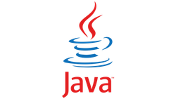

# 웹개발 - 자바
## 📒 마크다운 기본 사용법
+ https://www.markdownguide.org/basic-syntax/

## 💻 자바 프로젝트 생성 방법(VSCode)
1. 커맨드 팔레트 열기(단축키: ctrl+shift+p)
2. java: Create Java Project... 선택
3. No build tools 선택
4. project name 입력

## 📄 수업 자료
|Section|Title|Content|
|-------|-----|-------|
|1|오리엔테이션|<a href="https://treasure-snow-23c.notion.site/1-b7804cf77ba84e3cb6c3377d9711b476?pvs=4" target="_blank">바로가기</a>|
|2|자바 시작|<a href="https://treasure-snow-23c.notion.site/2-439a709f52164cf7b7a72baaa7372aad?pvs=4" target="_blank">바로가기</a>|
|3|연산자|<a href="https://treasure-snow-23c.notion.site/3-48d9c2b9ad514528ad1038e3174ac91c?pvs=4" target="_blank">바로가기</a>|
|4|제어문1|<a href="https://treasure-snow-23c.notion.site/4-1-3764191c2f72433cbdca961f2bd71589?pvs=4" target="_blank">바로가기</a>|
|5|제어문2|<a href="https://treasure-snow-23c.notion.site/5-2-acfa7b4ba17f44fabbbe34b01f77d945?pvs=4" target="_blank">바로가기</a>|
|6|제어문 응용|<a href="https://treasure-snow-23c.notion.site/6-e9e6ecb3166243ada148a9741cac0038?pvs=4" target="_blank">바로가기</a>|
|7|배열|<a href="https://treasure-snow-23c.notion.site/7-a8d7f64677824dc18c5259c130bbd68c?pvs=4" target="_blank">바로가기</a>|
|8|클래스1|<a href="https://treasure-snow-23c.notion.site/8-1-dcc30be158264ea6bfad2e0ca84ec468?pvs=4" target="_blank">바로가기</a>|
|9|클래스2|<a href="https://treasure-snow-23c.notion.site/9-2-63d2593df45d4052b2dcb122d50e1e8c?pvs=4" target="_blank">바로가기</a>|
|10|클래스2|<a href="https://treasure-snow-23c.notion.site/10-3-3a03d6b3e32e45faad8ebf65604f0faf?pvs=4" target="_blank">바로가기</a>|
|11|추상 클래스와 인터페이스|<a href="https://treasure-snow-23c.notion.site/11-68e918fbfa6745f59c28c2481d165d9d?pvs=4" target="_blank">바로가기</a>|
|12|다형성|<a href="https://treasure-snow-23c.notion.site/12-7e131692fd9c4aacb5c328a6259cb4fb?pvs=4" target="_blank">바로가기</a>|
|13|내부 클래스, 함수형 인터페이스|<a href="https://treasure-snow-23c.notion.site/13-be47c6441d06493f9be49887f7ce1d64?pvs=4">바로가기</a>|
|14|예외 처리|<a href="https://treasure-snow-23c.notion.site/14-662a59ea19b44b81a5399ea61b39261f?pvs=4">바로가기</a>|
|15|기본 API 클래스|<a href="https://treasure-snow-23c.notion.site/15-API-88204d5bbf7847afb4427be784c05a14?pvs=4">바로가기</a>|
|16|컬렉션 프레임워크|<a href="https://treasure-snow-23c.notion.site/16-d55b66ebbe5046afbd06287a67acaac7?pvs=4">바로가기</a>|
|17|컬렉션 프레임워크|<a href="https://treasure-snow-23c.notion.site/17-647dfee28496417c89bf3cbaabdadcdd?pvs=4">바로가기</a>|
|18|자바 입출력(I/O)|<a href="https://treasure-snow-23c.notion.site/18-I-O-6fc6dd52e1c040498ee2f0fc291c30ac?pvs=4" target="_blank">바로가기</a>|
|19|미니 프로젝트1|<a href="https://treasure-snow-23c.notion.site/19-1-03d3c9fb2b1f4199ad73436e29ff909e?pvs=4" target="_blank">바로가기</a>|
|20|미니 프로젝트2(JDBC 연동)|<a href="https://treasure-snow-23c.notion.site/20-2-JDBC-4b1a2f94f3204827a76c846879713ad2?pvs=4" target="_blank">바로가기</a>|

# 마크다운에서 동영상 재생 예시

## 1. 외부 링크 사용

[마크다운 소개 영상](https://www.youtube.com/watch?v=dQw4w9WgXcQ)

## 2. HTML 태그 사용 (지원하는 경우)

<iframe width="560" height="315" src="https://www.youtube.com/embed/dQw4w9WgXcQ" frameborder="0" allow="accelerometer; autoplay; clipboard-write; encrypted-media; gyroscope; picture-in-picture" allowfullscreen></iframe>

## 3. 이미지와 링크 결합

